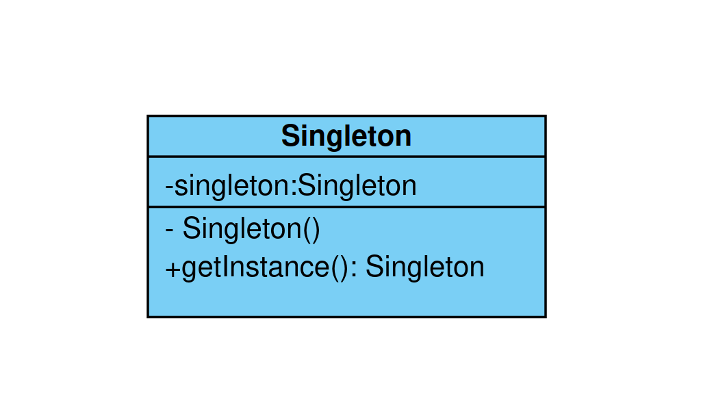

# Báo cáo tuần 2
Các công việc đã làm:
- a 
- b


## 1.Collections

### HashMap

- 'HashMap' là một cấu trúc dữ liệu sử dụng bảng băm `hash table` để lưu trữ các cặp khóa-giá trị (key-value). Nó cho phép truy cập dữ liệu nhanh chóng dựa trên khóa.

##### Đặc điểm:
-   Các phần tử trong HashMap không được lưu trữ theo thứ tự cụ thể.
-   Cho phép một khóa có giá trị là null và nhiều `value` là null.
-   Không cho phép các khóa trùng lặp; mỗi khóa là duy nhất.
-   Truy cập, thêm, và xóa phần tử nhanh chóng với thời gian trung bình là O(1), do đó phù hợp với các tình huống cần truy cập ngẫu nhiên và thao tác nhanh chóng.

``` java
import java.util.HashMap;

public class HashMapExample {
    public static void main(String[] args) {
        HashMap<Integer, String> map = new HashMap<>();

        map.put(1, "One");
        map.put(2, "Two");
        map.put(3, "Three");

        System.out.println(map.get(2));

        for (Integer key : map.keySet()) {
            System.out.println("Key: " + key + ", Value: " + map.get(key));
        }
    }
}

```

### HashSet

- `HashSet` là một tập hợp `set` không có thứ tự các phần tử và không cho phép các phần tử trùng lặp.
- `HashSet` thực chất là một `HashMap` không có giá trị `value`. Mỗi phần tử trong `HashSet` được lưu trữ như một khóa `key` trong `HashMap`.
##### Đặc điểm:
- Các phần tử trong HashSet không được lưu trữ theo thứ tự cụ thể.
- Không cho phép các phần tử trùng lặp.
- Cho phép một phần tử là null.
- Thời gian thao tác trung bình O(1) cho các hoạt động thêm, xóa và kiểm tra sự tồn tại của phần tử.
```java1
    import java.util.HashSet;

public class HashSetExample {
    public static void main(String[] args) {
        HashSet<String> set = new HashSet<>();

        set.add("One");
        set.add("Two");
        set.add("Three");
        set.add("One");

        for (String value : set) {
            System.out.println(value);
        }
    }
}

```
### ArraysLish
- `ArrayList` là một danh sách động `dynamic array` cho phép lưu trữ các phần tử theo thứ tự chèn vào và có thể thay đổi kích thước khi cần thiết.


```java
    import java.util.ArrayList;

public class ArrayListExample {
    public static void main(String[] args) {
        ArrayList<String> list = new ArrayList<>();

        list.add("One");
        list.add("Two");
        list.add("Three");
        list.add("One"); 

        System.out.println(list.get(1)); 
        
        for (String value : list) {
            System.out.println(value);
        }
    }
}

```

## 2.Design pattern

### 2.1 Creational pattern

### *Singleton
##### Khái niệm
- Là một trong nhóm `Creational`, nó sẽ đảm bảo duy nhất một thể thiện được tạo, hay còn có thể giải thích là xuyên suốt quá trình hoạt
động của ứng dụng chỉ có duy nhất một đối tượng được tạo ra từ một class.
#### Được sử dụng trong những trường hợp nào?
- Đảm bảo chỉ có một thể hiện(instance) duy nhất của một class.
- Có thể quản lý số lượng thể hiện của một lớp trong giới hạn ta muốn.
#### Nguyên tắc để tạo lên một Singleton
- Hàm tạo hay còn gọi là constructor có thể truy cập với private tức chỉ có thể truy xuất trong nội bộ của class.
- Thể hiện của nó được đặt dạng ' private static final variable' để đảm bảo biến chỉ được khởi tạo trong class.
- có một method 'public static' để trả về thể hiện được đề cập bên trên.
#### Có những cách tạo ra Singleton theo từng trường hợp sử dụng
- Trên thực tế chúng ta có rất nhiều cách để tạo ra một Singleton tuy nhiên mình sẽ chỉ giới thiệu những mẫu chính và thường gặp.
- Gồm 4 trường hợp sau : `Eager initialization`, `Lazy Initialization`, `Thread Safe`, `Double Check Locking`.



#### Example
##### Eager initialization
- Instance được tạo ngay lập tức khi lớp được tải, đẫn đến tiêu tốn tài nguyên khi không sử dụng.
- Đảm bảo thread-save mà không cần đồng bộ hóa. 
``` java
    public class EagerInitialization {
    private static final EagerInitialization INSTANCE = new EagerInitialization();

    private String name;

    private EagerInitialization(){

    }

    public static EagerInitialization getInstance(){
        return INSTANCE;
    }

    public String getName() {
        return name;
    }

    public void setName(String name) {
        this.name = name;
    }
}
```
##### Lazy Initialization
- Instance chỉ được khởi tạo khi cần thiết, tiết kiệm tài nguyên hơn eager initialization.
- Không có thread-save , có thể dẫn đến việc tạo nhiều instance khi có nhiều luồng truy cập đồng thời.
``` java
    public class LazyInitialization {
    private static LazyInitialization INSTANCE;

    private LazyInitialization(){}
    private String name;

    public static LazyInitialization getINSTANCE(){
        if(INSTANCE == null) {
            INSTANCE = new LazyInitialization();
        }
        return INSTANCE;

    }

    public String getName() {
        return name;
    }

    public void setName(String name) {
        this.name = name;
    }
}
```
##### Thread-Save  
-  sử dụng từ khóa `synchronized` để đồng bộ hóa phương thức getInstance(). Cách này đảm bảo chỉ một instance được tạo ra nhưng có thể gây ra hiệu suất chậm do việc đồng bộ hóa.
```java
    public class ThreadSafe {
    private static volatile ThreadSafe INSTANCE;

    private String name;

    private ThreadSafe(){};

    public static synchronized ThreadSafe getInstance(){
        if(INSTANCE == null){
            INSTANCE = new ThreadSafe();
        }
        return INSTANCE;
    }

    public String getName() {
        return name;
    }

    public void setName(String name) {
        this.name = name;
    }
}
```
##### Double check looking
- `Double-Checked Locking` là một cách tối ưu hơn để đảm bảo thread-safe mà không gây ảnh hưởng lớn đến hiệu suất. Chỉ sử dụng đồng bộ hóa khi instance chưa được tạo.

```java
    public class DoubleCheckLocking {
    private static volatile DoubleCheckLocking INSTANCE;

    private DoubleCheckLocking(){};

    private static DoubleCheckLocking getInstance(){
        if(INSTANCE == null){
            synchronized (DoubleCheckLocking.class){
                if(INSTANCE == null){
                    INSTANCE = new DoubleCheckLocking();
                }
            }
        }
        return INSTANCE;
    }
}
```

### 2.2 Structural Patterns


### *Adapter Design pattern

#### Khái niệm
-   Adapter Pattern giữ vai trò trung gian giữa hai lớp, chuyển đổi interface của một hay nhiều lớp có sẵn thành một interface khác.Như vậy sẽ cho phép các lớp có các class, interface không liên quan tới nhau có thể giao tiếp được với nhau.

#### Các thành phần

- `Adaptee`: định nghĩa interface,class không tương thích, cần được tích hợp vào.
- `Adapter`: lớp tích hợp, giúp interface,class không tương thích tích hợp được với interface,class đang làm việc. Thực hiện việc chuyển đổi giữa các interface, class không tương thích.
- `Target`: một interface chứa các chức năng được sử dụng bởi Client.

- `Client`: lớp sử dụng các đối tượng có interface Target.

#### Các loại Adapter
- Object Adapter – Composition : trong loại này, một lớp mới (Adapter) sẽ tham chiếu đến một (hoặc nhiều) đối tượng của lớp có sẵn với. Các bạn có thể hiểu Adaptee sẽ là một thuộc tích của Adapter.

- Class Adapter – Inheritance: Ở dạng Adapter sẽ kế thừa từ cả Adapter và Target và thực hiện cài đặt những interface mà người dùng mong muốn (Target).


### 2.3 Behavioral Patterns 

### *Iterator design pattern

#### Khái niệm
- Nếu trong project có quá nhiều cấu trúc dạng danh sách như cấu trúc cây, mảng, ngăn xếp, hàng đợi.... Và bạn muốn có một quy tắc chung cho chúng như đều có thêm sửa xoá chẳng hạn. Như vậy lúc này chúng ta có thể tìm tới Iterator.

- Như vậy chúng ta có thể hiểu Iterator là mẫu sẽ cung cấp cho chúng ta một cách truy cập tuần tự tới các phần tử của một đối tượng tổng hợp. Chúng ta có thể truy xuất tới các tập hợp theo cùng một cách thức.

#### Các thành phần
- `Aggregate` : là một interface định nghĩa định nghĩa các phương thức để tạo Iterator.
- `Concrete Aggregate` : cài đặt các phương thức của Aggregate, nó cài đặt interface tạo Iterator để trả về một thể hiện của ConcreteIterator thích hợp.
- `Iterator` : là một interface hay abstract class, định nghĩa các phương thức để truy cập và duyệt qua các phần tử.

- `Concrete Iterator` : cài đặt các phương thức của Iterator, giữ index khi duyệt qua các phần tử.

- `Client`: Đại diện cho nơi sử dụng Iterator nó sẽ yêu cầu duyệt qua các phần tử có trong Iterator cũng như truy xuất tới các phần tử theo quy trình thích hợp.


## 3.Serialize

- `Serialization` là một cơ chế dùng để chuyển đổi trạng thái của một đối tượng thành một chuỗi byte, sau đó có thể được phục hồi lại thành một đối tượng giống hệt ban đầu. Quá trình này rất cần thiết cho các tác vụ như lưu trữ đối tượng vào tệp, gửi đối tượng qua mạng, hoặc lưu trữ đối tượng trong cơ sở dữ liệu.

- `serialVersionUID`: Đây là một ID phiên bản dùng để đảm bảo rằng một lớp serial và `deserial` hóa là tương thích. Nếu không khai báo, `Java` sẽ tự động tạo một `serialVersionUID` dựa trên chi tiết lớp.
- `Transient Keyword`: Các trường được đánh dấu là `transient` sẽ không được serial.
```java
public class Person implements Serializable {

    private static final long serialVersionUID = 1L;
    
    private String transient id;
    private String name;
    private int age;

    public Person(String name, int age) {
        this.name = name;
        this.age = age;
    }

    @Override
    public String toString() {
        return "Person{name='" + name + "', age=" + age + "}";
    }
}

```
