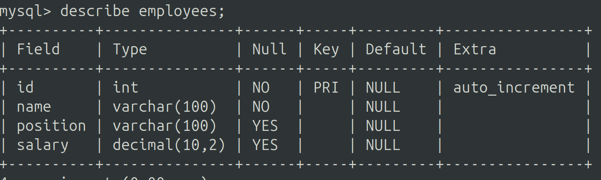
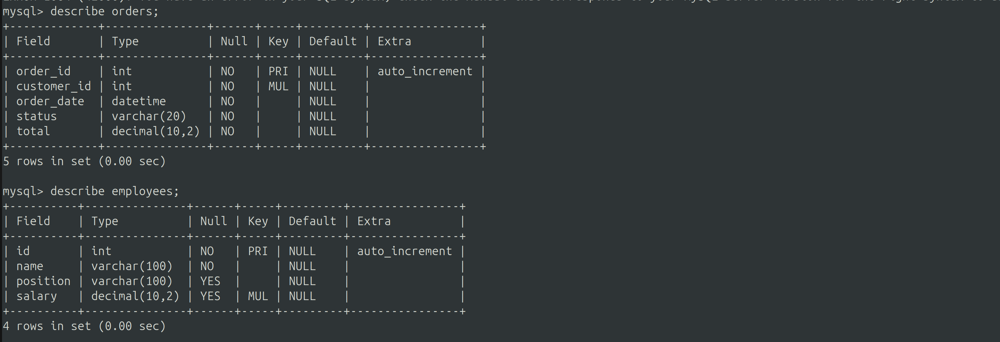

# Báo cáo tuần 4

# Yêu cầu 1

### 1. Vật lí (Physical Layer)

Vật lí trong MySQL bao gồm các thành phần quản lý cách dữ liệu được lưu trữ và truy cập trong hệ thống quản lý cơ sở dữ liệu. Các thành phần chính của vật lí bao gồm:

- `Storage Management`: Quản lý cách dữ liệu được tổ chức và lưu trữ trên đĩa hoặc trong bộ nhớ. MySQL sử dụng các cơ chế như bảng, chỉ mục, view để quản lý không gian lưu trữ.

- `Buffer Management`: Quản lý bộ đệm để tối ưu hóa hiệu suất truy cập dữ liệu bằng cách giữ các dữ liệu phổ biến trong bộ nhớ để giảm số lần truy cập đĩa.

- `File System Interface`: Tương tác với hệ điều hành để đọc và ghi dữ liệu từ/đến đĩa. MySQL sử dụng giao diện hệ thống tệp để quản lý các tệp dữ liệu và chỉ mục.

### 2. Parser

Parser trong MySQL có nhiệm vụ phân tích và chuyển đổi các câu lệnh SQL từ dạng văn bản thành cấu trúc cây (parse tree) để có thể xử lý bởi các phần mềm quản lý cơ sở dữ liệu. Các thành phần chính của parser bao gồm:

- `Lexical Analysis`: Phân tích cú pháp (lexical analysis) để chuyển đổi dòng văn bản SQL thành các đơn vị nhỏ hơn như từ vựng (tokens).

- `Syntax Analysis`: Phân tích cú pháp (syntax analysis) để kiểm tra tính hợp lệ của cú pháp SQL dựa trên các quy tắc ngữ pháp của MySQL.

### 3. Optimizer (Trình tối ưu hóa)

Optimizer là thành phần quan trọng trong MySQL, có nhiệm vụ tối ưu hóa câu lệnh SQL để tăng hiệu suất thực thi. Các bước tối ưu hóa bao gồm:

- `Query Parsing`: Parser chuyển đổi câu lệnh SQL thành cấu trúc cây để tối ưu hóa.

- `Query Optimization`: Thực hiện các chiến lược tối ưu hóa để chọn kế hoạch thực thi câu lệnh tốt nhất, bao gồm lựa chọn phương pháp tham gia bảng (join methods), sử dụng chỉ mục, v.v.

- `Cost Estimation`: Ước tính chi phí của các kế hoạch thực thi và chọn kế hoạch có chi phí thấp nhất để thực hiện câu lệnh SQL.

### 4. Storage Engines (Bộ lưu trữ)

Storage Engine là thành phần quản lý lưu trữ thực tế của dữ liệu trong MySQL. MySQL hỗ trợ nhiều loại Storage Engines để đáp ứng các yêu cầu lưu trữ và tính năng khác nhau. Các loại phổ biến bao gồm:

- `InnoDB`: Mặc định trong MySQL từ phiên bản 5.5 trở đi, hỗ trợ giao dịch ACID (Atomicity, Consistency, Isolation, Durability), khóa ngoài (foreign key), và tính năng phục hồi.

- `MyISAM`: Sử dụng trước đây, hỗ trợ chỉ đọc và ghi, không hỗ trợ giao dịch, nhưng có hiệu suất cao cho các hoạt động đọc.

- `Memory`: Lưu trữ dữ liệu trong bộ nhớ RAM, thích hợp cho các bảng tạm thời hoặc cache.

- `Archive`: Nén dữ liệu và lưu trữ nén, thích hợp cho việc lưu trữ lịch sử hoặc dữ liệu nhật ký.

- `CSV`: Lưu trữ dữ liệu dưới dạng file CSV, cho phép dễ dàng nhập và xuất dữ liệu.

Mỗi Storage Engine có các đặc điểm và tính năng riêng biệt, ảnh hưởng đến hiệu suất và tính năng của cơ sở dữ liệu MySQL. Người quản trị cơ sở dữ liệu thường lựa chọn Storage Engine phù hợp dựa trên yêu cầu cụ thể của ứng dụng và mục đích sử dụng.

# Yêu cầu 2.

  
  

## `SELECT * FROM employees WHERE salary > 500000;`
    
### So sánh EXPLAIN trước và sau khi tạo chỉ mục

Dưới đây là kết quả của lệnh `EXPLAIN` trước và sau khi tạo chỉ mục `idx_salary` trên bảng `employees`.

#### Trước khi tạo chỉ mục:

```sql
EXPLAIN SELECT * FROM employees WHERE salary > 500000;
```

```
+----+-------------+-----------+------------+------+---------------+------+---------+------+-------+----------+-------------+
| id | select_type | table     | partitions | type | possible_keys | key  | key_len | ref  | rows  | filtered | Extra       |
+----+-------------+-----------+------------+------+---------------+------+---------+------+-------+----------+-------------+
|  1 | SIMPLE      | employees | NULL       | ALL  | NULL          | NULL | NULL    | NULL | 99869 |    33.33 | Using where |
+----+-------------+-----------+------------+------+---------------+------+---------+------+-------+----------+-------------+
```

#### Sau khi tạo chỉ mục:

```sql
CREATE INDEX idx_salary ON employees(salary);
EXPLAIN SELECT * FROM employees WHERE salary > 500000;
```

```
+----+-------------+-----------+------------+-------+---------------+------------+---------+------+------+----------+-----------------------+
| id | select_type | table     | partitions | type  | possible_keys | key        | key_len | ref  | rows | filtered | Extra                 |
+----+-------------+-----------+------------+-------+---------------+------------+---------+------+------+----------+-----------------------+
|  1 | SIMPLE      | employees | NULL       | range | idx_salary    | idx_salary | 6       | NULL |    1 |   100.00 | Using index condition |
+----+-------------+-----------+------------+-------+---------------+------------+---------+------+------+----------+-----------------------+
```

### Phân tích chi tiết:

#### Trước khi tạo chỉ mục:

1. **type: ALL**:
   - MySQL thực hiện quét toàn bộ bảng, nghĩa là nó phải đọc toàn bộ 99,869 hàng trong bảng `employees`.
   - Điều này rất không hiệu quả, đặc biệt là khi bảng có nhiều hàng.

2. **key**: `NULL`:
   - Không có chỉ mục nào được sử dụng cho truy vấn này.

3. **rows**: `99869`:
   - MySQL ước tính sẽ phải đọc 99,869 hàng để tìm kiếm kết quả.
   - Điều này cho thấy một lượng công việc lớn mà MySQL phải thực hiện.

4. **filtered**: `33.33`:
   - Chỉ 33.33% của các hàng sẽ được giữ lại sau khi áp dụng điều kiện WHERE.

5. **Extra: Using where**:
   - Điều kiện WHERE được áp dụng sau khi quét toàn bộ bảng.

#### Sau khi tạo chỉ mục:

1. **type: range**:
   - MySQL sử dụng truy vấn phạm vi (`range`) trên chỉ mục `idx_salary`.
   - Điều này rất hiệu quả, vì MySQL chỉ cần quét một phạm vi nhỏ trong chỉ mục thay vì toàn bộ bảng.

2. **key**: `idx_salary`:
   - MySQL sử dụng chỉ mục `idx_salary` cho truy vấn này.

3. **rows**: `1`:
   - MySQL ước tính chỉ cần đọc 1 hàng để tìm kiếm kết quả.
   - Điều này cho thấy một lượng công việc rất nhỏ mà MySQL phải thực hiện, cải thiện đáng kể hiệu suất truy vấn.

4. **filtered**: `100.00`:
   - 100% các hàng trong phạm vi chỉ mục sẽ được giữ lại sau khi áp dụng điều kiện WHERE.

5. **Extra: Using index condition**:
   - MySQL đang sử dụng điều kiện chỉ mục để tối ưu hóa truy vấn.
   - Điều này có nghĩa là điều kiện WHERE được áp dụng trực tiếp trong quá trình quét chỉ mục, giúp tăng hiệu quả.

### Kết luận:

- **Trước khi tạo chỉ mục**, MySQL phải quét toàn bộ bảng `employees`, dẫn đến hiệu suất kém vì phải đọc rất nhiều hàng.
- **Sau khi tạo chỉ mục**, MySQL chỉ cần quét một phạm vi nhỏ trong chỉ mục `idx_salary`, dẫn đến hiệu suất cải thiện đáng kể.
- Việc sử dụng chỉ mục giúp MySQL tìm kiếm các hàng phù hợp nhanh hơn và giảm số lượng hàng cần phải đọc, do đó cải thiện hiệu suất truy vấn.

## Sử dụng JOIN mà không có chỉ mục

```sql
SELECT orders.order_id, customers.first_name 
FROM orders 
JOIN customers ON orders.customer_id = customers.customer_id;

```
```
+----+-------------+-----------+------------+------+---------------+-------------+---------+----------------------------+-------+----------+-------------+
| id | select_type | table     | partitions | type | possible_keys | key         | key_len | ref                        | rows  | filtered | Extra       |
+----+-------------+-----------+------------+------+---------------+-------------+---------+----------------------------+-------+----------+-------------+
|  1 | SIMPLE      | customers | NULL       | ALL  | PRIMARY       | NULL        | NULL    | NULL                       | 99338 |   100.00 | NULL        |
|  1 | SIMPLE      | orders    | NULL       | ref  | customer_id   | customer_id | 4       | test.customers.customer_id |     1 |   100.00 | Using index |
+----+-------------+-----------+------------+------+---------------+-------------+---------+----------------------------+-------+----------+-------------+

```
- tối ưu:

```sql
ALTER TABLE orders ADD INDEX (customer_id);
ALTER TABLE customers ADD INDEX (customer_id);
SELECT orders.order_id, customers.first_name 
FROM orders 
JOIN customers ON orders.customer_id = customers.customer_id;

```

```
+----+-------------+-----------+------------+--------+---------------------+-------------+---------+-------------------------+--------+----------+-------------+
| id | select_type | table     | partitions | type   | possible_keys       | key         | key_len | ref                     | rows   | filtered | Extra       |
+----+-------------+-----------+------------+--------+---------------------+-------------+---------+-------------------------+--------+----------+-------------+
|  1 | SIMPLE      | orders    | NULL       | index  | customer_id         | customer_id | 4       | NULL                    | 100167 |   100.00 | Using index |
|  1 | SIMPLE      | customers | NULL       | eq_ref | PRIMARY,customer_id | PRIMARY     | 4       | test.orders.customer_id |      1 |   100.00 | NULL        |
+----+-------------+-----------+------------+--------+---------------------+-------------+---------+-------------------------+--------+----------+-------------+

```

## Tối ưu với Full-Text Index
```
mysql> explain SELECT * FROM employees WHERE name LIKE '%Employee2%';
+----+-------------+-----------+------------+------+---------------+------+---------+------+-------+----------+-------------+
| id | select_type | table     | partitions | type | possible_keys | key  | key_len | ref  | rows  | filtered | Extra       |
+----+-------------+-----------+------------+------+---------------+------+---------+------+-------+----------+-------------+
|  1 | SIMPLE      | employees | NULL       | ALL  | NULL          | NULL | NULL    | NULL | 99869 |    11.11 | Using where |
+----+-------------+-----------+------------+------+---------------+------+---------+------+-------+----------+-------------+
1 row in set, 1 warning (0.00 sec)

```
```
mysql> ALTER TABLE employees ADD FULLTEXT INDEX idx_name_fulltext (name);
Query OK, 0 rows affected, 1 warning (0.98 sec)
Records: 0  Duplicates: 0  Warnings: 1

mysql> explain SELECT * FROM employees WHERE MATCH(name) AGAINST('Employee2' IN NATURAL LANGUAGE MODE);
+----+-------------+-----------+------------+----------+-------------------+-------------------+---------+-------+------+----------+-------------------------------+
| id | select_type | table     | partitions | type     | possible_keys     | key               | key_len | ref   | rows | filtered | Extra                         |
+----+-------------+-----------+------------+----------+-------------------+-------------------+---------+-------+------+----------+-------------------------------+
|  1 | SIMPLE      | employees | NULL       | fulltext | idx_name_fulltext | idx_name_fulltext | 0       | const |    1 |   100.00 | Using where; Ft_hints: sorted |
+----+-------------+-----------+------------+----------+-------------------+-------------------+---------+-------+------+----------+-------------------------------+
1 row in set, 1 warning (0.00 sec)


```
## Truy vấn bổ sung với Composite Index
```
mysql> explain  SELECT * FROM orders WHERE order_date = '2023-07-16' and status = 'Pending' ;
+----+-------------+--------+------------+------+---------------+------+---------+------+--------+----------+-------------+
| id | select_type | table  | partitions | type | possible_keys | key  | key_len | ref  | rows   | filtered | Extra       |
+----+-------------+--------+------------+------+---------------+------+---------+------+--------+----------+-------------+
|  1 | SIMPLE      | orders | NULL       | ALL  | NULL          | NULL | NULL    | NULL | 100167 |     1.00 | Using where |
+----+-------------+--------+------------+------+---------------+------+---------+------+--------+----------+-------------+
1 row in set, 1 warning (0.00 sec)

```
```
mysql> ALTER TABLE orders ADD INDEX idx_order_date_status (order_date,status);
Query OK, 0 rows affected (0.16 sec)
Records: 0  Duplicates: 0  Warnings: 0

mysql> explain  SELECT * FROM orders WHERE order_date = '2023-07-16' and status = 'Pending' ;
+----+-------------+--------+------------+------+-----------------------+-----------------------+---------+-------------+------+----------+-------+
| id | select_type | table  | partitions | type | possible_keys         | key                   | key_len | ref         | rows | filtered | Extra |
+----+-------------+--------+------------+------+-----------------------+-----------------------+---------+-------------+------+----------+-------+
|  1 | SIMPLE      | orders | NULL       | ref  | idx_order_date_status | idx_order_date_status | 87      | const,const |    1 |   100.00 | NULL  |
+----+-------------+--------+------------+------+-----------------------+-----------------------+---------+-------------+------+----------+-------+
1 row in set, 1 warning (0.00 sec)

```
## Sử dụng LIKE với wildcard ở đầu
```
mysql> explain select * from employees where name like '%em%';
+----+-------------+-----------+------------+------+---------------+------+---------+------+-------+----------+-------------+
| id | select_type | table     | partitions | type | possible_keys | key  | key_len | ref  | rows  | filtered | Extra       |
+----+-------------+-----------+------------+------+---------------+------+---------+------+-------+----------+-------------+
|  1 | SIMPLE      | employees | NULL       | ALL  | NULL          | NULL | NULL    | NULL | 99764 |    11.11 | Using where |
+----+-------------+-----------+------------+------+---------------+------+---------+------+-------+----------+-------------+
1 row in set, 1 warning (0.00 sec)

```
```
mysql> create index idx_name_salary_position on employees(name,salary,position);
Query OK, 0 rows affected (0.28 sec)
Records: 0  Duplicates: 0  Warnings: 0

mysql> explain select * from employees where name like 'em%';
+----+-------------+-----------+------------+-------+-----------------------------------+--------------------------+---------+------+-------+----------+--------------------------+
| id | select_type | table     | partitions | type  | possible_keys                     | key                      | key_len | ref  | rows  | filtered | Extra                    |
+----+-------------+-----------+------------+-------+-----------------------------------+--------------------------+---------+------+-------+----------+--------------------------+
|  1 | SIMPLE      | employees | NULL       | range | idx_name,idx_name_salary_position | idx_name_salary_position | 402     | NULL | 49882 |   100.00 | Using where; Using index |
+----+-------------+-----------+------------+-------+-----------------------------------+--------------------------+---------+------+-------+----------+--------------------------+
1 row in set, 1 warning (0.00 sec)

```
## Sử dụng subquery không cần thiết
```
mysql> explain select * from customers where customer_id in (select customer_id from orders where status = 'Pending');
+----+--------------+-------------+------------+--------+---------------------+---------+---------+-------------------------+--------+----------+-------------+
| id | select_type  | table       | partitions | type   | possible_keys       | key     | key_len | ref                     | rows   | filtered | Extra       |
+----+--------------+-------------+------------+--------+---------------------+---------+---------+-------------------------+--------+----------+-------------+
|  1 | SIMPLE       | <subquery2> | NULL       | ALL    | NULL                | NULL    | NULL    | NULL                    |   NULL |   100.00 | NULL        |
|  1 | SIMPLE       | customers   | NULL       | eq_ref | PRIMARY,customer_id | PRIMARY | 4       | <subquery2>.customer_id |      1 |   100.00 | NULL        |
|  2 | MATERIALIZED | orders      | NULL       | ALL    | customer_id         | NULL    | NULL    | NULL                    | 100167 |    10.00 | Using where |
+----+--------------+-------------+------------+--------+---------------------+---------+---------+-------------------------+--------+----------+-------------+
3 rows in set, 1 warning (0.00 sec)

```
```
mysql> explain select c.* from customers c join orders o on c.customer_id = o.customer_id where status = 'Pending';
+----+-------------+-------+------------+--------+---------------------+---------+---------+--------------------+--------+----------+-------------+
| id | select_type | table | partitions | type   | possible_keys       | key     | key_len | ref                | rows   | filtered | Extra       |
+----+-------------+-------+------------+--------+---------------------+---------+---------+--------------------+--------+----------+-------------+
|  1 | SIMPLE      | o     | NULL       | ALL    | customer_id         | NULL    | NULL    | NULL               | 100167 |    10.00 | Using where |
|  1 | SIMPLE      | c     | NULL       | eq_ref | PRIMARY,customer_id | PRIMARY | 4       | test.o.customer_id |      1 |   100.00 | NULL        |
+----+-------------+-------+------------+--------+---------------------+---------+---------+--------------------+--------+----------+-------------+
2 rows in set, 1 warning (0.00 sec)

```

# Yêu cầu 3.

### Các loại Cơ sở dữ liệu SQL (Relational Databases):
1. **MySQL**: Đây là một hệ quản trị cơ sở dữ liệu quan hệ mã nguồn mở phổ biến, hỗ trợ nhiều tính năng như giao transact (ACID), tương thích đa nền tảng.
   
2. **PostgreSQL**: Một hệ quản trị cơ sở dữ liệu quan hệ mã nguồn mở mạnh mẽ, hỗ trợ các tính năng phong phú bao gồm ACID, JSON, và mở rộng với PostGIS cho địa lý.

3. **Oracle Database**: Là một hệ quản trị cơ sở dữ liệu mạnh mẽ, cung cấp tính năng ACID, hỗ trợ quản lý dữ liệu lớn và các tính năng quản lý cao cấp.

### Các loại Cơ sở dữ liệu NoSQL:
1. **MongoDB**: Là một cơ sở dữ liệu NoSQL dạng tài liệu, lưu trữ dữ liệu dưới dạng JSON-like document, linh động và dễ mở rộng.

2. **Redis**: Là một cơ sở dữ liệu NoSQL dạng key-value, hỗ trợ lưu trữ dữ liệu tại bộ nhớ, phù hợp cho các ứng dụng yêu cầu thời gian phản hồi nhanh.

3. **Cassandra**: Là một cơ sở dữ liệu NoSQL dạng cột, được thiết kế cho các hệ thống phân tán quy mô lớn, hỗ trợ tính mở rộng tuyến tính.

### Các khái niệm quan trọng:
- **CAP Theorem**: Định lý CAP quan điểm rằng trong một hệ thống phân tán, không thể đảm bảo đồng thời tính nhất quán (Consistency), sẵn sàng (Availability), và chịu chấp nhận được (Partition tolerance). Hệ thống chỉ có thể đạt được hai trong số ba yếu tố này cùng một lúc.
  
- **BASE**: Được đề xuất như một phương pháp thay thế cho ACID trong các hệ thống NoSQL, BASE đặc trưng cho Basically Available, Soft state, Eventual consistency. BASE cho phép hệ thống có thể đạt được khả năng sẵn sàng cao và độ nhất quán cuối cùng (eventual consistency).

- **ACID**: Là một thuật ngữ dùng để mô tả tính chất của giao transact trong cơ sở dữ liệu quan hệ, bao gồm Atomicity (tính nguyên tử), Consistency (tính nhất quán), Isolation (tính độc lập), và Durability (tính bền vững).

### Ba dạng chuẩn của CSDL (Normal Forms):
1. **First Normal Form (1NF)**: Mỗi ô trong bảng chỉ chứa một giá trị duy nhất.

2. **Second Normal Form (2NF)**: Mọi thuộc tính không thuộc khóa chính phụ thuộc hoàn toàn vào khóa chính.

3. **Third Normal Form (3NF)**: Mọi thuộc tính không thuộc khóa chính không phụ thuộc vào các thuộc tính phi khóa chính.

