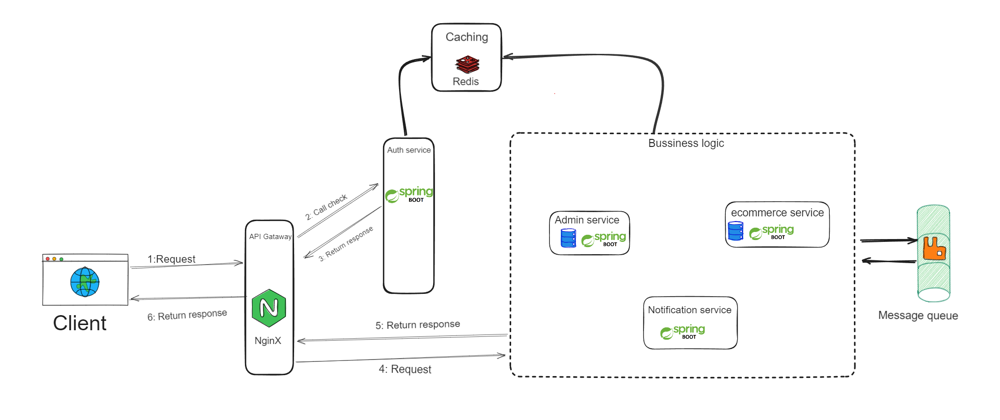
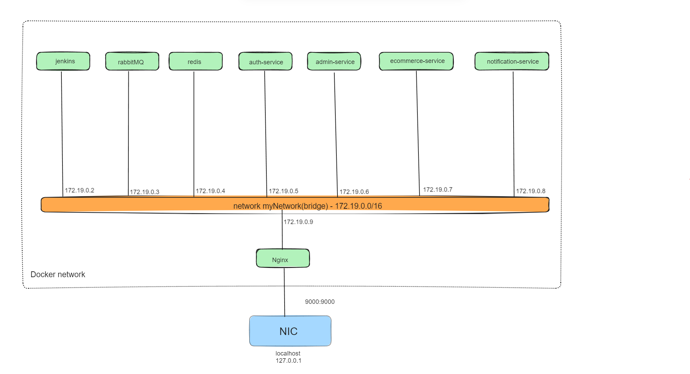

# Báo cáo tuần 5

## Triển khai service lên docker sử dụng jenkins.
Các service cần triển khai:
- Ecommerce service: https://github.com/LG-BaoPTIT/ecommerce-service.git
- Admin service: https://github.com/LG-BaoPTIT/admin-service.git
- Auth service: https://github.com/LG-BaoPTIT/auth-service.git
- Notification service: https://github.com/LG-BaoPTIT/notification-service.git

Chuẩn bị tài nguyên cho hệ thống:
- Container redis
- Container rabbitMQ
- Container Nginx
- Container jenkins

#### 1. Tạo container nginx.
- Tải image nginx: `docker pull nginx`

- Tạo thư mục cấu mình nginx bên máy host: `mkdir C:\nginx-config`

- Chạy container nginx và ánh xạ file nginx.conf của máy host vào container. Bằng cách này ta có thể chỉnh sửa file cấu hình bên ngoài máy host 1 cách dễ dàng:
  `docker run -d --name my-nginx -p 9000:9000 --network myNetwork --ip 172.19.0.9 -v C:/nginx-config/nginx.conf:/etc/nginx/nginx.conf:ro nginx`

#### 2. Tạo container redis.

- Pull image redis: `docker pull redis`

- Tạo và chạy container: `docker run -d --name redis-container -p 6379:6379 --network --ip 172.19.0.4 myNetwork redis:latest`

#### 3. Tạo container rabbitMQ

-Pull image rabbitmq: `docker pull rabbitmq:management`

-Tạo và chạy container: `docker run -d --name rabbitmq-container -p 5672:5672 -p 15672:15672 --network  myNetwork --ip 172.19.0.3 rabbitmq:management`

### 4. Tạo container jenkins
`docker run -u root --privileged --rm --name jenkins -d -p 8080:8080 -p 50000:50000 -v /var/run/docker.sock:/var/run/docker.sock -v jenkins_home:/var/jenkins_home jenkins/jenkins:latest`

