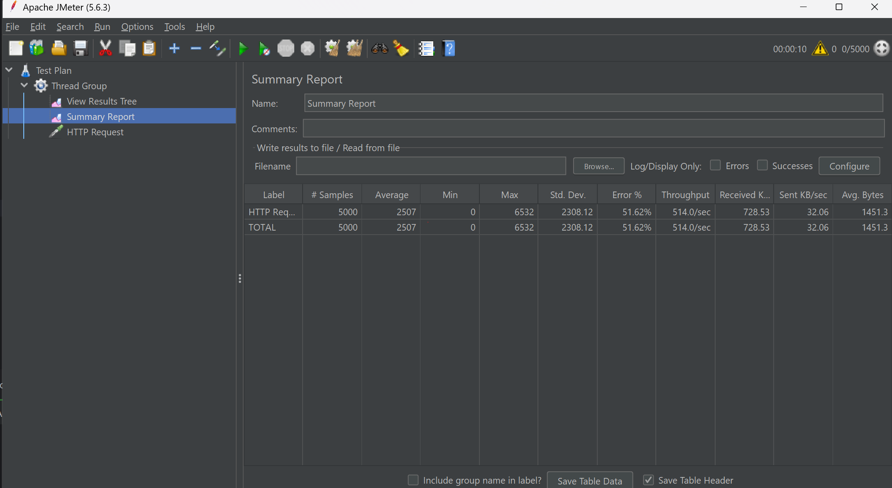

# Bác cáo tuần 6

## Kiểm thử phần mềm

### 1. Unit Testing

**Mục đích**: Xác minh từng phần nhỏ (unit) của mã nguồn hoạt động đúng cách. Một "unit" thường là một phương thức hoặc hàm trong một lớp.

**Đặc điểm**:
- Tập trung vào các phần tử nhỏ nhất của mã nguồn.
- Thường được thực hiện bởi các lập trình viên trong quá trình phát triển.

### 2. Functional Testing

**Mục đích**: Xác minh rằng các chức năng của phần mềm hoạt động như mong đợi. Kiểm thử chức năng tập trung vào kết quả đầu ra dựa trên đầu vào cụ thể.

**Đặc điểm**:
- Kiểm thử các chức năng cụ thể của phần mềm.
- Thực hiện mà không cần quan tâm đến cấu trúc nội bộ của mã nguồn.
- Sử dụng các công cụ như Selenium (web), QTP (QuickTest Professional), hoặc Appium (mobile).

**Ví dụ**: Kiểm thử tính năng đăng nhập, thêm sản phẩm vào giỏ hàng, v.v.

### 3. Integration Testing

**Mục đích**: Xác minh rằng các module hoặc dịch vụ tích hợp với nhau hoạt động đúng cách.

**Đặc điểm**:
- Tập trung vào sự tương tác giữa các module hoặc dịch vụ.
- Có thể sử dụng các phương pháp kiểm thử như kiểm thử bottom-up, top-down hoặc sandwich.
- Sử dụng các framework như Spring Test (Java), TestNG, hoặc JUnit kết hợp với các công cụ mock (Mockito).

### 4. Load/Stress Testing

**Mục đích**: Xác minh hiệu suất của phần mềm dưới các điều kiện tải cao. Load testing kiểm tra hoạt động dưới tải thông thường, trong khi stress testing kiểm tra dưới tải rất cao hoặc trong các tình huống giới hạn.

**Đặc điểm**:
- Kiểm thử khả năng chịu tải của hệ thống.
- Đánh giá thời gian phản hồi, tài nguyên sử dụng, và khả năng chịu lỗi.
- Sử dụng các công cụ như Apache JMeter, LoadRunner, hoặc Gatling.

##  Tìm hiểu về cache (redis)
Redis, viết tắt của Remote Dictionary Server là một hệ thống lưu trữ dữ liệu key-value trong bộ nhớ mã nguồn mở dùng để lưu trữ dữ liệu có cấu trúc, có thể sử dụng như một database, bộ nhớ cache hay một message broker. Điểm đặc biệt của Redis nằm ở khả năng lưu trữ toàn bộ dữ liệu trong bộ nhớ RAM, thay vì trên ổ cứng như các hệ thống cơ sở dữ liệu truyền thống.

- [Lưu trữ dữ liệu trong RAM](#lưu-trữ-dữ-liệu-trong-ram)
- [Cấu trúc dữ liệu được tối ưu hóa](#cấu-trúc-dữ-liệu-được-tối-ưu-hóa)
- [I/O Multiplexing & Single-threaded](#io-multiplexing--single-threaded)
- [Kết luận](#kết-luận)

---

### Lưu trữ dữ liệu trong RAM

Redis nổi bật với khả năng lưu trữ dữ liệu trong RAM, khác biệt so với các hệ quản trị cơ sở dữ liệu truyền thống như PostgreSQL, MySQL hay Cassandra vốn lưu trữ dữ liệu trên ổ đĩa. Trong khi các cơ sở dữ liệu truyền thống sử dụng các cấu trúc dữ liệu trên đĩa như B+ tree hoặc B tree để tối ưu hóa việc truy xuất dữ liệu, Redis hoạt động trực tiếp trên bộ nhớ RAM. Điều này mang lại lợi thế to lớn về mặt tốc độ:

- Việc lấy dữ liệu từ RAM nhanh hơn hàng nghìn lần so với truy xuất từ ổ đĩa.
- Các cơ sở dữ liệu truyền thống cần gọi đến I/O để đọc dữ liệu từ đĩa, gây ra độ trễ đáng kể. Redis bỏ qua bước này, dữ liệu được lấy trực tiếp từ bộ nhớ.

### Cấu trúc dữ liệu được tối ưu hóa

Sức mạnh của Redis không chỉ nằm ở việc lưu trữ dữ liệu trong RAM mà còn ở khả năng cung cấp một loạt các cấu trúc dữ liệu được tối ưu hóa cho hiệu suất cao.

- **Strings:** Cấu trúc dữ liệu cơ bản nhất, có thể lưu trữ string, integer, float hoặc dữ liệu nhị phân. 
- **Lists:** List là một danh sách của strings, sắp xếp theo thứ tự insert. Redis có thể thêm một phần tử vào đầu hoặc cuối list. List phù hợp cho các bài toán cần thao tác với các phần tử gần đầu và cuối vì việc truy xuất này là cực nhanh, cho dù insert cả triệu phần tử. Tuy nhiên nhược điểm là việc truy cập vào các phần tử ở giữa list rất chậm.
- **Sets:** Tập hợp các string (không được sắp xếp). Redis hỗ trợ các thao tác thêm, đọc, xóa từng phần tử, kiểm tra sự xuất hiện của phần tử trong tập hợp. Ngoài ra Redis còn hỗ trợ các phép toán tập hợp, gồm intersect/union/difference.
- **Sorted Sets:** Là kiểu dữ liệu tương tự như sets nhưng được sắp xếp theo một floating-point number.
- **Hashed:** Lưu trữ hash table của các cặp key-value, trong đó key được sắp xếp ngẫu nhiên, không theo thứ tự nào cả. Redis hỗ trợ các thao tác thêm, đọc, xóa từng phần tử, cũng như đọc tất cả giá trị.

Ngoài ra còn các kiểu dữ liệu khác như Streams, Geospatial indexes, Bitmaps, Bitfields, HyperLogLog.

### I/O Multiplexing & Single-threaded

#### I/O Multiplexing

I/O Multiplexing là kĩ thuật cho phép Redis theo dõi nhiều kết nối (sockets) cùng lúc. Các hoạt động I/O thường chậm hơn nhiều so với các xử lý trong RAM, nếu phải đợi tuần tự các hoạt động này thực thi xong thì hiệu suất sẽ bị giảm đáng kể. Do đó, Redis đã sử dụng các cơ chế của hệ điều hành như epoll (Linux) hoặc kqueue (FreeBSD) để thực hiện I/O Multiplexing một cách hiệu quả. Khi có dữ liệu sẵn sàng trên bất kỳ socket nào, Redis sẽ xử lý nó ngay lập tức mà không phải chờ đợi các socket khác.

#### Event Loop

- **Hoạt động:** Redis chạy một vòng lặp sự kiện liên tục theo dõi các sockets. Khi có dữ liệu sẵn sàng, nó sẽ được chuyển vào hàng đợi xử lý (task queue).
- **Phân loại:** Vòng lặp sự kiện phân loại dữ liệu thành các loại khác nhau (ví dụ: đọc dữ liệu từ socket, chấp nhận kết nối mới) và gửi chúng đến các trình xử lý tương ứng.

#### Single Thread (Đơn luồng)

Redis áp dụng mô hình đơn luồng, nghĩa là tất cả các lệnh đều được xử lý bởi một luồng duy nhất. Điều này mang lại nhiều lợi ích:

- Loại bỏ hoàn toàn overhead từ việc chuyển đổi ngữ cảnh (context switching) giữa các luồng.
- Tránh được các vấn đề phức tạp liên quan đến đồng bộ hóa và cạnh tranh tài nguyên (locking).
- Mô hình này hoạt động hiệu quả vì các thao tác của Redis chủ yếu diễn ra trong bộ nhớ RAM, với tốc độ xử lý ở mức nano giây hoặc micro giây, nhanh hơn nhiều so với thời gian I/O thông thường (mili giây).

**Kết hợp các yếu tố:**

- I/O Multiplexing đảm bảo Redis không bị trì hoãn bởi các hoạt động I/O chậm chạp.
- Single Thread loại bỏ overhead, tối ưu hóa hiệu suất.
- Event Loop điều phối và quản lý hiệu quả các tác vụ.

### Stress test
